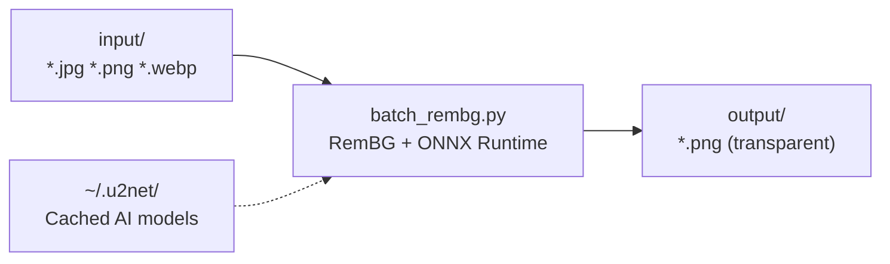

<div align="center">

# batch-rembg

  

Simple Python wrapper around [rembg](https://github.com/danielgatis/rembg) for batch processing. Point it at a folder of images, get transparent PNGs. Runs locally on CPU via ONNX Runtime, no API keys required.



<table>
<tr>
<td align="center"><strong>Before</strong></td>
<td align="center"><strong>After</strong></td>
</tr>
<tr>
<td></td>
<td></td>
</tr>
</table>


</div>

---

## Quick Start

```bash
git clone https://github.com/Liamhbray/batch-rembg.git
cd batch-rembg
uv sync
mkdir input
cp /path/to/your/images/*.jpg input/
uv run python batch_rembg.py
```

Output PNGs with transparent backgrounds appear in `output/`. The first run downloads the AI model (~176MB) — internet required once.

---

## Usage

```bash
python batch_rembg.py                          # Process all images in input/
python batch_rembg.py --limit 10               # Test on first 10 images
python batch_rembg.py --model u2netp           # 3x faster (smaller model)
python batch_rembg.py --skip-existing          # Resume an interrupted batch
python batch_rembg.py --dry-run                # Preview without processing
python batch_rembg.py --pattern "*product*"    # Filter by filename
python batch_rembg.py --help                   # Show all options
```

---

## CLI Reference

| Flag | Short | Description |
|------|-------|-------------|
| `--input` | `-i` | Input directory (default: `input/`) |
| `--output` | `-o` | Output directory (default: `output/`) |
| `--model` | `-m` | AI model selection (default: `u2net`) |
| `--limit` | `-l` | Process only first N images |
| `--pattern` | `-p` | Filename filter pattern |
| `--skip-existing` | `-s` | Skip already-processed files |
| `--dry-run` | `-d` | Preview mode, no processing |
| `--quiet` | `-q` | Minimal output |
| `--list-models` | | Show available models |
| `--error-log` | | Custom error log path |

---

## Models

| Model | Size | Speed (CPU) | Best For |
|-------|------|-------------|----------|
| **`u2net`** (default) | 176MB | 1.5-2 img/s | General purpose |
| **`u2netp`** | 4.7MB | 4-6 img/s | Speed, testing |
| **`birefnet-general`** | 973MB | 0.8-1 img/s | Professional, complex images |
| `u2net_human_seg` | 176MB | 1.5-2 img/s | Portraits |
| `u2net_cloth_seg` | 176MB | 1.5-2 img/s | Fashion |
| `silueta` | - | ~2 img/s | General alternative |
| `isnet-general-use` | - | ~2 img/s | IS-Net variant |

<details>
<summary><strong>Performance estimates for 5,000 images</strong></summary>

| Model | Time |
|-------|------|
| `u2netp` | ~15-20 minutes |
| `u2net` | ~42-55 minutes |
| `birefnet-general` | ~80-100 minutes |

Memory usage: ~500MB-1GB. Output PNGs are typically 2-4x larger than input JPGs.

</details>

---

## Requirements

- **Python** 3.9+
- **OS** macOS, Linux, or Windows
- **Internet** for first run only (model download)
- **Disk** ~500MB for default model; ~1GB for birefnet

---

## Troubleshooting

<details>
<summary><strong>Wrong Python version</strong></summary>

Verify with `python --version`. Requires 3.9+. On some systems use `python3`.
</details>

<details>
<summary><strong>No module named 'rembg'</strong></summary>

Virtual environment may not be active. Run `uv sync` to install dependencies, or `source .venv/bin/activate` then retry.
</details>

<details>
<summary><strong>Model download fails</strong></summary>

The first run fetches the model from Hugging Face. Check your internet connection. Corporate firewalls may block `huggingface.co`.
</details>

<details>
<summary><strong>Memory errors</strong></summary>

Close other applications. Process in smaller batches with `--limit 500`.
</details>

<details>
<summary><strong>Slow processing</strong></summary>

Switch to `u2netp` for 3x speed: `python batch_rembg.py --model u2netp`. CPU-only is expected.
</details>

---

## License

[MIT](LICENSE)
